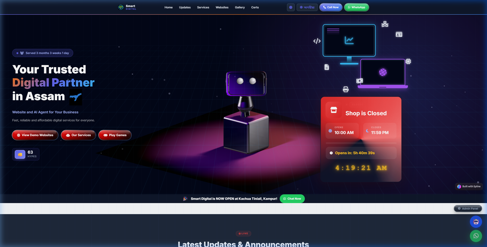
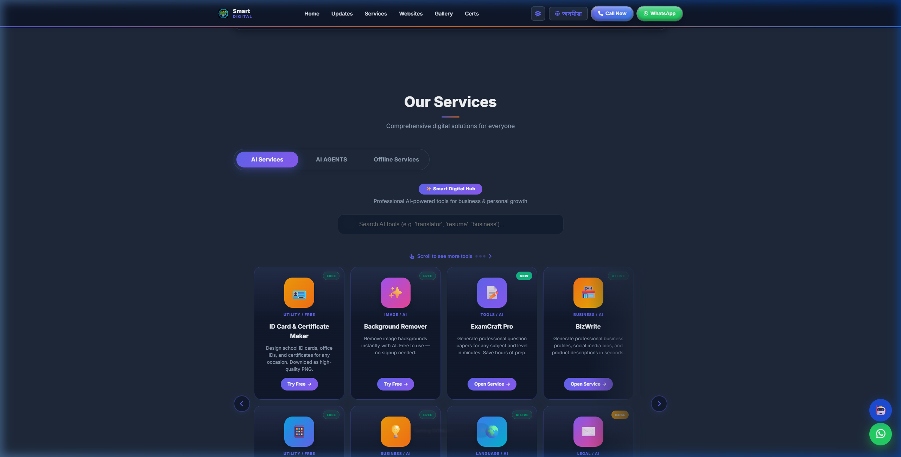
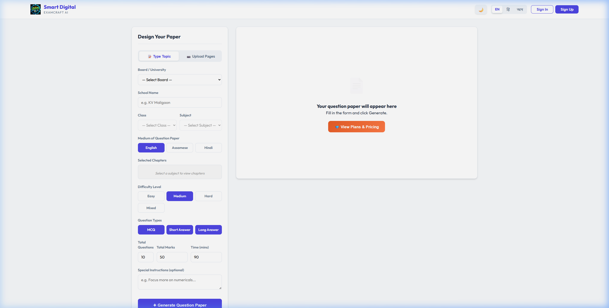
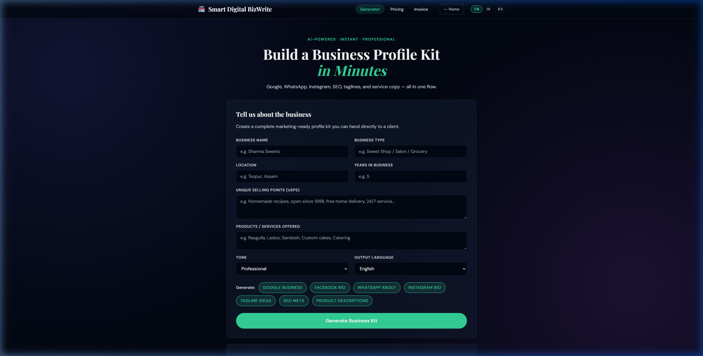
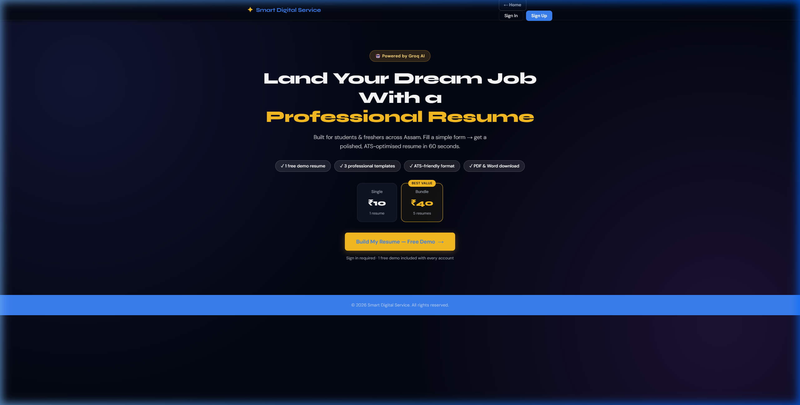
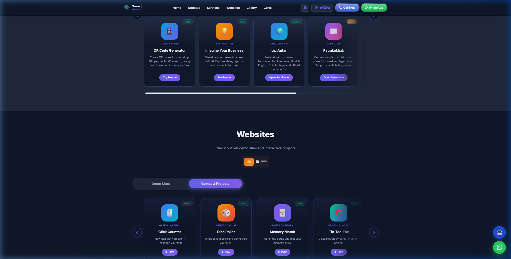

# Smart Digital — AI Tool Hub & Business Website

> A full-stack static web platform combining a local-business showcase site with **9 browser-based AI apps**, **10 HTML5 games**, a live **Firebase-powered notice board**, and an embedded **AI chatbot** — all built with **vanilla HTML/CSS/JS**, no framework, no build step.

**Live Demo:** https://smartdigitalkampur.netlify.app
**Repo:** https://github.com/smartdigital-sum/m

---

## Screenshots

> Drop your PNGs into `docs/screenshots/` with the filenames below and they will render here.

| Homepage | AI Services | ExamCraft Pro |
|---|---|---|
|  |  |  |

| BizWrite | Resume Builder | Games Hub |
|---|---|---|
|  |  |  |

---

## What It Does

Smart Digital serves two audiences from a single static codebase:

1. **Business showcase** — Hero, services, demo websites, gallery, certificates, and a live shop-status widget for the offline shop in Kampur, Assam.
2. **Online AI tool hub** — 9 standalone apps that solve real-world problems for small businesses, students, and teachers in Northeast India. Bilingual UI (English + Assamese) throughout.

### AI-Powered Apps (`apps/`)

| App | Purpose |
|---|---|
| **ExamCraft Pro** | AI question-paper generator — SEBA / AHSEC / CBSE / ICSE boards, Classes 1–12, EN/HI/AS output |
| **BizWrite** | One-shot business-profile kit: Google Business, FB bio, WhatsApp about, Insta bio, tagline, SEO meta |
| **PatraLekhak** | Plain-language → formal complaint / legal letter (Bank, RTI, Legal Notice, etc.) with PDF export |
| **ScriptWala** | WhatsApp script packs (reply templates, promos, festive messages) in Formal / Friendly / Hinglish / Assamese |
| **ShopWrite AI** | Product descriptions (3 variants) + SEO keywords + hashtags for e-commerce listings |
| **LipiAntar** | Document translator with Assamese support |
| **Resume Builder** | AI-assisted resume generator with PDF/DOCX export |
| **ID Maker** | Free ID card & certificate designer |
| **QR Generator** | Free QR code generator |

### Other Modules

- **Games** (`games/`) — Snake, Memory Match, Flappy Bird, Space Shooter, Tic-Tac-Toe, Simon Says, Typing Speed, Rock-Paper-Scissors, Dice Roller, Click Counter.
- **AI Chatbot** (`chatbot/`) — Floating widget backed by Groq's `llama-3.3-70b-versatile`.
- **Business Generator** (`generator/`) — "Imagine your business online" interactive tool.
- **Admin Panel** — Password-protected overlay that posts live notices to Firebase; visitors see them in real-time on the Notice Board.

---

## Tech Stack

| Layer | Tech |
|---|---|
| Frontend | Vanilla HTML5, CSS3, JavaScript (ES6+) — no framework, no bundler |
| Hosting | Netlify (static + serverless functions) |
| Database | Firebase Realtime Database |
| Auth | Firebase Auth (Email / Password) |
| AI (primary) | Groq API — `llama-3.3-70b-versatile` |
| AI (secondary) | Anthropic Claude API — `claude-haiku-4-5` |
| PDF / DOCX | `html2pdf.js`, `jsPDF`, `docx`, `FileSaver.js` |
| Icons / Fonts | Font Awesome 6, Google Fonts |

### Key Engineering Decisions

- **No build step.** Every file is served as-is so the owner can edit in the browser if needed.
- **API-key safety.** API keys live in `assets/js/config.js` locally, but on production Netlify serverless functions (`netlify/functions/`) proxy all AI calls so the key never ships to the browser.
- **Self-contained apps.** Each `apps/<name>/` has its own `index.html`, `style.css`, `app.js` — no cross-app coupling.
- **Bilingual system.** Every user-visible string uses `data-en="..."` / `data-as="..."`. A single `toggleLanguage()` swaps the whole page — nav, cards, buttons, headings — in one pass.
- **Persistent global counters.** The "hype" counter (like button) writes to Firebase Realtime DB so the count is global across all visitors.

---

## Project Structure

```
smartdigital/
├── index.html                  # Main homepage
├── assets/                     # Global CSS, JS, images, Firebase SDK
├── apps/                       # 9 standalone AI apps
├── games/                      # 10 HTML5 games
├── chatbot/                    # Floating AI chatbot widget
├── generator/                  # "Imagine your business" tool
├── netlify/functions/          # Serverless API-key proxy
├── firebase-rules.json         # Realtime DB security rules
├── netlify.toml                # Netlify config
└── WEBSITE_DOCUMENTATION.md    # Full technical deep-dive
```

---

## Setup & Run Locally

**Requirements:** any modern browser + (optional) Node.js 18+ if you want to run the Netlify functions locally.

```bash
# 1. Clone
git clone https://github.com/smartdigital-sum/m.git smartdigital
cd smartdigital

# 2. Option A — open directly in the browser
#    Just open index.html. On localhost the AI keys are read from config.js.

# 3. Option B — run with Netlify Dev (serverless functions active)
npm install -g netlify-cli
netlify dev
# opens http://localhost:8888
```

### Configure API Keys

Edit `assets/js/config.js` with your own keys:

```js
window.SMART_DIGITAL_CONFIG = {
  GROQ:   { API_KEY: "gsk_...", MODEL: "llama-3.3-70b-versatile", ... },
  CLAUDE: { API_KEY: "sk-ant-...", MODEL: "claude-haiku-4-5-20251001", ... },
  ADMIN_EMAIL: "you@example.com"
};
```

For production, set `GROQ_API_KEY` and `CLAUDE_API_KEY` in Netlify env vars instead — the serverless functions will proxy them.

### Firebase

Replace the Firebase config block at the top of `index.html` with your own project config, and upload `firebase-rules.json` to your Realtime DB rules.

---

## Deployment (Netlify)

1. Push to GitHub.
2. "New site from Git" on Netlify, point at the repo.
3. Build command: _(none)_ — Publish directory: `.`
4. Add env vars: `GROQ_API_KEY`, `CLAUDE_API_KEY`.
5. Deploy. Done.

---

## Highlights for Reviewers

- 9 apps, 10 games, 1 chatbot, 1 admin CMS, 1 notice board — all in one static repo
- Real users: aimed at small businesses, students, and teachers in Assam
- Bilingual English / Assamese UI across every page
- Safe AI key handling via Netlify functions
- Firebase-backed real-time features without a custom backend
- Works offline-first where possible (localStorage history, no hard backend dependency for most apps)

Full technical walkthrough: see [WEBSITE_DOCUMENTATION.md](WEBSITE_DOCUMENTATION.md).

---

## Contact

**Suman Bisas** — Smart Digital, Kampur, Assam
WhatsApp: [+91 86387 59478](https://wa.me/918638759478) · Email: sumanbisas123@gmail.com
