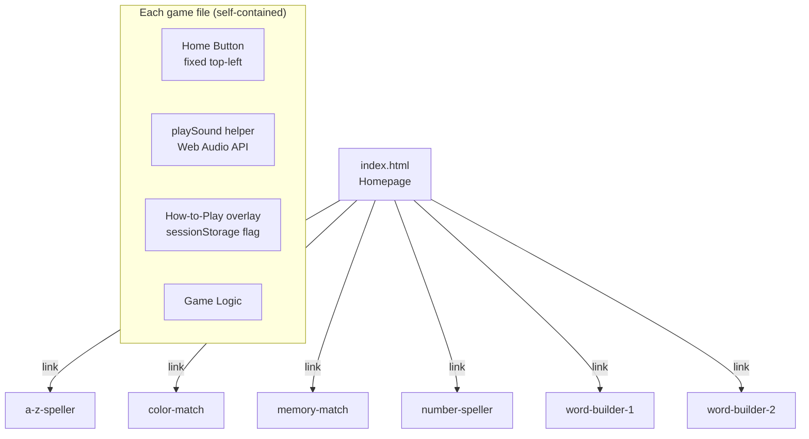

# Design Document

## Overview

This document describes the technical design for the Khelona improvements. The project is a pure HTML/CSS/JS site with no build tools or frameworks — each game is a self-contained HTML file. All changes are additive patches to existing files; no new files are created except for shared utilities that are inlined per-file (since there is no module system).

The improvements fall into these categories:

1. **Cross-cutting** — home button, audio, tap-target sizing, how-to-play overlay
2. **Homepage** — age badge text, difficulty badges
3. **Color Match** — remove timer, keep lives
4. **A-Z Speller** — letter picker, word replacements
5. **Word Builder 1 & 2** — word replacements
6. **Memory Match** — Easy/Normal mode selector

---

## Architecture

The site has a flat structure with no shared JS or CSS files:

```
index.html                        ← homepage
games/
  a-z-speller/index.html
  color-match/index.html
  memory-match/index.html
  number-speller/index.html
  word-builder-1/index.html
  word-builder-2/index.html
```

Because there is no module system, every cross-cutting concern (home button, audio, how-to-play) is implemented by adding the same small snippet to each game file. This is intentional — it keeps each file self-contained and deployable without a build step.



---

## Components and Interfaces

### 2.1 Home Button

A fixed-position anchor element injected into every game page's `<body>`.

```html
<a href="../../index.html" class="home-btn" aria-label="Home">🏠 Home</a>
```

CSS (added to each game's `<style>` block):

```css
.home-btn {
  position: fixed;
  top: 12px;
  left: 12px;
  z-index: 1000;
  background: rgba(255,255,255,0.92);
  border: 2px solid rgba(0,0,0,0.08);
  border-radius: 50px;
  padding: 8px 16px;
  font-family: 'Nunito', sans-serif;
  font-weight: 800;
  font-size: 0.95rem;
  color: #555;
  text-decoration: none;
  box-shadow: 0 2px 10px rgba(0,0,0,0.12);
  transition: transform 0.15s, box-shadow 0.15s;
}
.home-btn:hover { transform: translateY(-2px); box-shadow: 0 4px 16px rgba(0,0,0,0.18); }
```

The button uses `z-index: 1000` to sit above all game overlays. It is an `<a>` tag (not a `<button>`) so it navigates without JS.

### 2.2 Audio — `playSound(type)`

A shared function added to each game's `<script>` block. Uses the Web Audio API only — no external files.

```js
const _ac = new (window.AudioContext || window.webkitAudioContext)();

function playSound(type) {
  if (_ac.state === 'suspended') _ac.resume();
  const gain = _ac.createGain();
  gain.connect(_ac.destination);

  if (type === 'tap') {
    const o = _ac.createOscillator();
    o.connect(gain);
    o.frequency.value = 600; o.type = 'sine';
    gain.gain.setValueAtTime(0.08, _ac.currentTime);
    gain.gain.exponentialRampToValueAtTime(0.001, _ac.currentTime + 0.1);
    o.start(); o.stop(_ac.currentTime + 0.1);

  } else if (type === 'correct') {
    [523, 659, 784].forEach((f, i) => {
      const o = _ac.createOscillator(); o.connect(gain);
      o.frequency.value = f; o.type = 'sine';
      gain.gain.setValueAtTime(0.1, _ac.currentTime + i * 0.12);
      gain.gain.exponentialRampToValueAtTime(0.001, _ac.currentTime + i * 0.12 + 0.25);
      o.start(_ac.currentTime + i * 0.12);
      o.stop(_ac.currentTime + i * 0.12 + 0.25);
    });

  } else if (type === 'wrong') {
    const o = _ac.createOscillator(); o.connect(gain);
    o.frequency.value = 300; o.type = 'square';
    gain.gain.setValueAtTime(0.07, _ac.currentTime);
    gain.gain.exponentialRampToValueAtTime(0.001, _ac.currentTime + 0.2);
    o.start(); o.stop(_ac.currentTime + 0.2);

  } else if (type === 'win') {
    [523, 659, 784, 1047].forEach((f, i) => {
      const o = _ac.createOscillator(); o.connect(gain);
      o.frequency.value = f; o.type = 'sine';
      gain.gain.setValueAtTime(0.1, _ac.currentTime + i * 0.15);
      gain.gain.exponentialRampToValueAtTime(0.001, _ac.currentTime + i * 0.15 + 0.35);
      o.start(_ac.currentTime + i * 0.15);
      o.stop(_ac.currentTime + i * 0.15 + 0.35);
    });
  }
}
```

Sound types:
| Type | Trigger | Description |
|------|---------|-------------|
| `tap` | tile/card tap | Short 600 Hz sine blip |
| `correct` | correct answer | Rising 3-note arpeggio (C5→E5→G5) |
| `wrong` | wrong answer | Low square-wave buzz |
| `win` | game complete | 4-note ascending fanfare |

Games that already have their own audio (Memory Match has `playSound` with `flip`/`match`/`wrong`/`win`) will have their existing function replaced with the standardised one, mapping old type names to new ones where needed.

### 2.3 Tap Target Sizing

Each game's CSS is patched to add `min-width: 80px; min-height: 80px` to the relevant selector:

| Game | Selector |
|------|----------|
| A-Z Speller | `.tile` |
| Color Match | `.btn` |
| Memory Match | `.card` |
| Number Speller | `.tile` |
| Word Builder 1 | `.tile` |
| Word Builder 2 | `.tile` |

### 2.4 How-to-Play Overlay

Each game gets a fixed overlay with a short description. A `sessionStorage` key per game (`htp_<gameName>`) prevents it from showing more than once per session.

HTML structure (added before `</body>`):

```html
<div class="htp-overlay" id="htpOverlay">
  <div class="htp-card">
    <div class="htp-emoji"><!-- game emoji --></div>
    <h2 class="htp-title">How to Play</h2>
    <p class="htp-text"><!-- ≤3 sentence description --></p>
    <button class="htp-btn" onclick="dismissHtp()">Got it! 👍</button>
  </div>
</div>
```

JS logic:

```js
function initHtp(key) {
  if (!sessionStorage.getItem(key)) {
    document.getElementById('htpOverlay').classList.add('show');
  }
}
function dismissHtp() {
  sessionStorage.setItem(/* key */, '1');
  document.getElementById('htpOverlay').classList.remove('show');
}
```

`initHtp` is called on page load (not inside `startGame`) so it appears before the game's own start overlay. The how-to-play overlay has `z-index: 200` so it sits above the game's start screen overlay.

### 2.5 Homepage — Age Badge & Difficulty Badges

**Age badge**: Change the text content of `.age-badge` from `"👶 Ages 3-6 Years"` to `"👶 Ages 0-3 Years"`.

**Difficulty badges**: A new CSS class `.card-difficulty` is added alongside the existing `.card-category` badge in each card's `.card-meta` div.

```css
.card-difficulty {
  padding: 6px 14px;
  border-radius: 50px;
  font-size: 0.8rem;
  font-weight: 800;
  text-transform: uppercase;
  letter-spacing: 0.5px;
}
.card-difficulty.easy  { background: #e8f8ee; color: #2d9e5f; }
.card-difficulty.medium { background: #fff3e0; color: #e07b00; }
```

Difficulty assignments:
| Game | Badge |
|------|-------|
| A-Z Speller | Medium |
| Color Match | Easy |
| Memory Match | Easy |
| Number Speller | Medium |
| Word Builder 1 | Easy |
| Word Builder 2 | Easy |

### 2.6 Color Match — Remove Timer

Changes to `games/color-match/index.html`:

1. Remove the `timerInterval` variable, `tick()` function, and `setInterval` call from `startGame()`.
2. Remove `clearInterval(timerInterval)` from `endGame()`.
3. Remove the timer ring HTML (`<div class="timer-ring-wrap">…</div>`) and its CSS (`.timer-ring-wrap`, `.timer-svg`, `.timer-bg`, `.timer-arc`, `.timer-label`).
4. Remove `timeLeft` and `TOTAL_TIME` variables.
5. The `endGame()` trigger remains only in `handleAnswer` when `lives <= 0`.
6. The end screen title is changed from `"⏰ Time's Up!"` / `"💔 Out of Lives!"` to always show `"💔 Out of Lives!"`.
7. The `endMsg` scoring thresholds remain but are based on `score` (correct answers), not time.

### 2.7 A-Z Speller — Letter Picker & Word Replacements

**Word replacements** in the `AW` data array:

| Letter | Old word | New word | New emoji |
|--------|----------|----------|-----------|
| E | ELM 🌳 | EAR 👂 | 👂 |
| I | IVY 🌿 | INK 🖊️ | 🖊️ |
| O | OAK 🌳 | OAT 🌾 | 🌾 |
| Q | QUIZ ❓ | QUACK 🦆 | 🦆 |
| Q | QUAIL 🐦 | QUEEN 👑 | 👑 |
| U | URN 🏺 | UP ⬆️ | ⬆️ |
| X | XRAY 🦴 | XMAS 🎄 | 🎄 |
| X | XMAS 🎄 | BOX 📦 | 📦 |

**Letter picker** on the start screen:

The existing start overlay (`#ovStart`) is modified to include a 26-letter grid above the "Play All A→Z" button. Each letter button calls `startFromLetter(index)`.

```html
<!-- inside #ovStart, replacing the single button -->
<div class="letter-picker" id="letterPicker">
  <!-- 26 buttons, A–Z, generated by JS -->
</div>
<button class="pbtn" onclick="startGame()">▶ Play All A→Z</button>
```

JS additions:

```js
function buildLetterPicker() {
  const grid = document.getElementById('letterPicker');
  AW.forEach(({ l, c }, i) => {
    const btn = document.createElement('button');
    btn.className = 'lp-btn';
    btn.textContent = l;
    btn.style.background = c;
    btn.onclick = () => startFromLetter(i);
    grid.appendChild(btn);
  });
}

function startFromLetter(idx) {
  document.getElementById('ovStart').classList.remove('show');
  document.getElementById('ovEnd').classList.remove('show');
  lIdx = idx;
  wIdx = 0;
  spl = new Array(26).fill(-1);
  clStars = 0;
  pickALetterMode = true;
  buildRound();
}
```

A `pickALetterMode` boolean flag tracks whether the player is in single-letter mode. When both words for the chosen letter are done, a completion screen is shown offering "Pick Another Letter" (returns to start screen) or "Play Again" (replays same letter).

### 2.8 Word Builder 1 & 2 — Word Replacements

In both `word-builder-1/index.html` and `word-builder-2/index.html`, patch the `WORDS` array:

```js
// Replace:
{ word: "JAR", emoji: "🫙", color: "#6BCB77" }
// With:
{ word: "BAG", emoji: "👜", color: "#6BCB77" }

// Replace:
{ word: "MAP", emoji: "🗺️", color: "#4D96FF" }
// With:
{ word: "MOP", emoji: "🧹", color: "#4D96FF" }
```

### 2.9 Memory Match — Easy/Normal Mode Selector

A mode selector is added to the controls bar. The existing `totalPairs` variable (currently hardcoded to `8`) becomes reactive.

HTML addition (inside `.controls`):

```html
<div class="mode-btns">
  <button class="mode-btn active" id="mode-easy" onclick="setMode('easy')">⭐ Easy (4 pairs)</button>
  <button class="mode-btn" id="mode-normal" onclick="setMode('normal')">🧠 Normal (8 pairs)</button>
</div>
```

JS:

```js
let currentMode = 'easy'; // default

function setMode(mode) {
  currentMode = mode;
  totalPairs = mode === 'easy' ? 4 : 8;
  document.getElementById('mode-easy').classList.toggle('active', mode === 'easy');
  document.getElementById('mode-normal').classList.toggle('active', mode === 'normal');
  // Update grid columns
  document.getElementById('game-board').style.gridTemplateColumns =
    mode === 'easy' ? 'repeat(4, 1fr)' : 'repeat(4, 1fr)';
  newGame();
}
```

Grid layout:
- Easy (4 pairs = 8 cards): `grid-template-columns: repeat(4, 1fr)` → 2 rows × 4 columns
- Normal (8 pairs = 16 cards): `grid-template-columns: repeat(4, 1fr)` → 4 rows × 4 columns

Both modes use a 4-column grid; Easy just has fewer rows.

---

## Data Models

### Game State (per game, in-memory JS variables)

No persistent data model is needed. All state lives in JS variables within each HTML file's `<script>` block. The only persistence used is `sessionStorage` for the how-to-play flag.

**sessionStorage keys:**

| Key | Value | Purpose |
|-----|-------|---------|
| `htp_az` | `"1"` | A-Z Speller HTP shown |
| `htp_cm` | `"1"` | Color Match HTP shown |
| `htp_mm` | `"1"` | Memory Match HTP shown |
| `htp_ns` | `"1"` | Number Speller HTP shown |
| `htp_wb1` | `"1"` | Word Builder 1 HTP shown |
| `htp_wb2` | `"1"` | Word Builder 2 HTP shown |

**Memory Match mode state:**

```
currentMode: 'easy' | 'normal'   // default: 'easy'
totalPairs:  4 | 8               // derived from currentMode
```

**A-Z Speller pick-a-letter state:**

```
pickALetterMode: boolean   // true when started from letter picker
lIdx: 0–25                 // current letter index
```

---

## Correctness Properties

*A property is a characteristic or behavior that should hold true across all valid executions of a system — essentially, a formal statement about what the system should do. Properties serve as the bridge between human-readable specifications and machine-verifiable correctness guarantees.*


### Property Reflection

Before writing properties, reviewing for redundancy:

- 2.7 (home button visible) and 2.1–2.6 (home button exists with correct href) — the existence check subsumes the visibility check; combine into one property covering all game pages.
- 3.1–3.6 (tap target size per game) — all are the same rule applied to different selectors; combine into one property: "for any interactive element in any game, min-width and min-height ≥ 80px".
- 4.2 and 4.3 (correct/wrong sound called) — these are distinct sound types and distinct triggers; keep separate.
- 6.1 (no timer end) and 6.4 (lives decrement on wrong) — distinct properties; keep separate.
- 10.1 (HTP shown on first visit) and 10.4 (HTP not shown after dismissal) — these are complementary round-trip properties; keep both as they test different directions.
- 11.1 (every card has difficulty badge) subsumes 11.2–11.7 (specific text per card) for the structural check; keep 11.1 as a property and treat 11.2–11.7 as examples.
- 12.x (Memory Match matching logic) — the core matching rule is a single property: for any two flipped cards, matched iff same id.

After reflection, the consolidated testable properties are:

1. Home button present and navigates correctly on all game pages
2. All interactive tap targets meet 80px minimum size
3. Correct answer triggers `playSound('correct')` call
4. Wrong answer triggers `playSound('wrong')` call
5. Color Match game only ends when lives reach zero (no timer path)
6. Color Match lives decrement on wrong answer
7. A-Z Speller: starting from any letter sets lIdx to that letter's index
8. How-to-Play overlay shown on first session visit (no sessionStorage key)
9. How-to-Play overlay not shown after dismissal (sessionStorage key set)
10. Every homepage game card has a difficulty badge element
11. Memory Match: two cards with same id are marked matched; two with different ids are not

---

### Property 1: Home button present on all game pages

*For any* game page in the Khelona site, the page SHALL contain an anchor element with class `home-btn` whose `href` attribute equals `../../index.html`.

**Validates: Requirements 2.1, 2.2, 2.3, 2.4, 2.5, 2.6, 2.7**

---

### Property 2: Tap targets meet minimum size

*For any* interactive tile, button, or card element rendered in any game page, the element's computed `min-width` and `min-height` CSS values SHALL each be at least 80px.

**Validates: Requirements 3.1, 3.2, 3.3, 3.4, 3.5, 3.6**

---

### Property 3: Correct answer plays correct sound

*For any* game page and any correct answer event, the `playSound` function SHALL be called with the argument `'correct'`.

**Validates: Requirements 4.2**

---

### Property 4: Wrong answer plays wrong sound

*For any* game page and any incorrect answer event, the `playSound` function SHALL be called with the argument `'wrong'`.

**Validates: Requirements 4.3**

---

### Property 5: Color Match ends only on lives exhaustion

*For any* Color Match game session, the `endGame` function SHALL only be reachable via the `lives <= 0` branch, and SHALL NOT be reachable via any timer-based code path.

**Validates: Requirements 6.1, 6.3**

---

### Property 6: Color Match lives decrement on wrong answer

*For any* Color Match game session, after each incorrect answer, the `lives` variable SHALL decrease by exactly 1.

**Validates: Requirements 6.4**

---

### Property 7: A-Z Speller letter picker sets correct start index

*For any* letter index `i` in the range 0–25, calling `startFromLetter(i)` SHALL set `lIdx` to `i` before the first round is built.

**Validates: Requirements 7.2**

---

### Property 8: How-to-Play shown on first session visit

*For any* game page opened when its corresponding `sessionStorage` key is absent, the how-to-play overlay element SHALL have the `show` class applied on page load.

**Validates: Requirements 10.1**

---

### Property 9: How-to-Play not shown after dismissal

*For any* game page, after `dismissHtp()` is called, the corresponding `sessionStorage` key SHALL be set to `"1"`, and the overlay SHALL not have the `show` class.

**Validates: Requirements 10.4**

---

### Property 10: Every game card has a difficulty badge

*For any* game card element (`.game-card`) on the homepage, the card SHALL contain a child element with class `card-difficulty` that has a non-empty text content.

**Validates: Requirements 11.1, 11.8**

---

### Property 11: Memory Match card matching correctness

*For any* two flipped cards in Memory Match, if their `dataset.id` values are equal they SHALL receive the `matched` class; if their `dataset.id` values differ they SHALL have the `flipped` class removed after the mismatch delay.

**Validates: Requirements 12.2, 12.3**

---

## Error Handling

### AudioContext Suspended State

The Web Audio API requires a user gesture before audio can play. The `playSound` function always checks `_ac.state === 'suspended'` and calls `_ac.resume()` before creating oscillators. This is an async operation but since audio is non-critical feedback, no error handling beyond the resume call is needed.

### sessionStorage Unavailable

In private browsing or restricted environments, `sessionStorage` may throw. The how-to-play init is wrapped in a try/catch — if sessionStorage is unavailable, the overlay is simply not shown (fail-open, not fail-closed, since the game is still playable).

```js
function initHtp(key) {
  try {
    if (!sessionStorage.getItem(key)) {
      document.getElementById('htpOverlay').classList.add('show');
    }
  } catch (e) {
    // sessionStorage unavailable — skip HTP overlay
  }
}
```

### Memory Match — Insufficient Data for Easy Mode

The `pickPairs` function slices `totalPairs` items from the shuffled category data. Each category has 12 items, so 4 pairs (Easy) and 8 pairs (Normal) are always satisfiable. No error handling needed.

### A-Z Speller — Letter Picker Out of Bounds

`startFromLetter(i)` validates `i` is in range 0–25 before setting `lIdx`. If called with an out-of-range value (which cannot happen via the UI), it falls back to `lIdx = 0`.

---

## Testing Strategy

### Dual Testing Approach

Both unit tests and property-based tests are used. Unit tests cover specific examples and integration points; property tests verify universal rules across many generated inputs.

### Unit Tests

Unit tests focus on:
- Specific DOM structure checks (home button href, difficulty badge text, age badge text)
- Data array contents (word replacements in AW, WORDS arrays)
- Game state initialization (Memory Match defaults to Easy, lives starts at 3)
- sessionStorage interaction (HTP flag set/cleared correctly)
- End-screen content (Color Match shows score, not time message)

Example unit test cases:
- `index.html` age badge text equals `"👶 Ages 0-3 Years"`
- Each game page has `.home-btn[href="../../index.html"]`
- `AW[4].w[1].word === 'EAR'` (E letter, second word replaced)
- `AW[16].w[0].word === 'QUACK'` (Q letter, first word replaced)
- `WORDS` in word-builder-1 does not contain `{ word: "JAR" }` or `{ word: "MAP" }`
- Memory Match `currentMode === 'easy'` and `totalPairs === 4` on init
- Color Match has no `timerInterval` variable or `tick` function

### Property-Based Tests

Property-based testing library: **fast-check** (JavaScript, browser-compatible via CDN or test runner).

Minimum 100 iterations per property test.

Each test is tagged with a comment referencing the design property:
`// Feature: khelona-improvements, Property N: <property_text>`

**Property test specifications:**

| Property | Generator | Assertion |
|----------|-----------|-----------|
| P2: Tap target size | Generate game page name from enum | For each `.tile`/`.btn`/`.card` in that page, computed style `min-width` and `min-height` ≥ 80 |
| P3: Correct sound | Generate random correct-answer events | `playSound` spy called with `'correct'` |
| P4: Wrong sound | Generate random wrong-answer events | `playSound` spy called with `'wrong'` |
| P5: Color Match no timer end | Generate random sequences of correct/wrong answers (lives > 0) | `endGame` not called |
| P6: Color Match lives decrement | Generate random wrong-answer count (1–3) | `lives` decreases by that count |
| P7: Letter picker index | Generate random integer 0–25 | After `startFromLetter(i)`, `lIdx === i` |
| P8: HTP shown on first visit | Generate random game key not in sessionStorage | Overlay has `show` class |
| P9: HTP dismissed | Generate random game key | After `dismissHtp()`, key in sessionStorage and overlay lacks `show` |
| P10: Difficulty badge on all cards | Generate random card index 0–5 | Card has `.card-difficulty` child with non-empty text |
| P11: Memory Match matching | Generate random pairs of card ids (same or different) | Matched iff ids equal |

**Property test configuration:**
- Run with `fast-check` `fc.assert(fc.property(...), { numRuns: 100 })`
- Tests run in a jsdom environment (Jest + jsdom) or directly in-browser with a test harness
- Each property test file is co-located with the game it tests

### Test File Structure

```
tests/
  unit/
    homepage.test.js
    az-speller.test.js
    color-match.test.js
    memory-match.test.js
    word-builder.test.js
    htp.test.js
  property/
    tap-targets.property.test.js      // P2
    audio-feedback.property.test.js   // P3, P4
    color-match.property.test.js      // P5, P6
    az-speller.property.test.js       // P7
    htp.property.test.js              // P8, P9
    homepage.property.test.js         // P10
    memory-match.property.test.js     // P11
```
